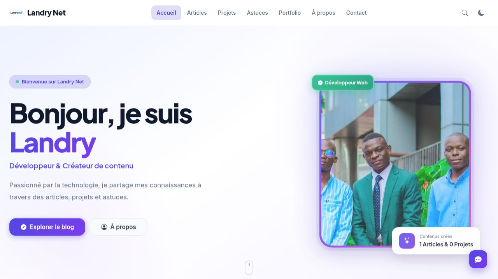
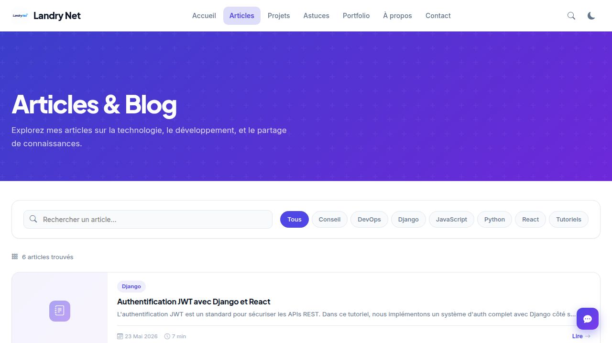
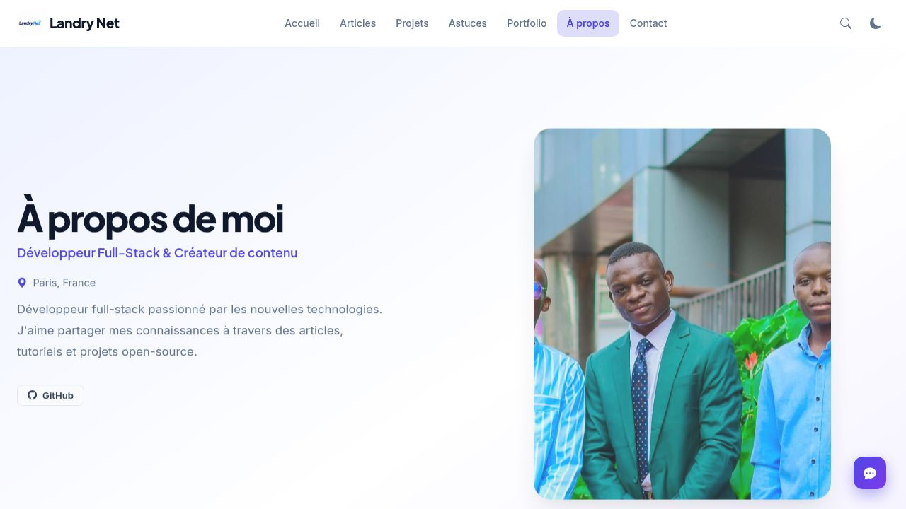
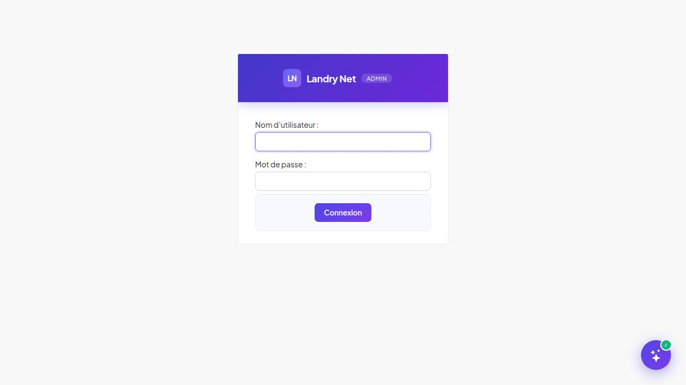

# Landry Net — Site Web Personnel

Site personnel full-stack construit avec **Django 5.2** (templates + API REST).  
Blog, projets, astuces, portfolio, newsletter, commentaires, réactions — et un **admin enrichi par l'IA**.

---

## Captures d'écran

| Accueil | Articles |
|---------|---------|
|  |  |

| À propos | Admin (login) |
|---------|---------|
|  |  |

---

## Stack technique

| Couche | Technologie |
|--------|------------|
| Backend | Django 5.2 + Django REST Framework |
| Templates | Django Templates |
| Base de données | SQLite (dev) / PostgreSQL (prod) |
| Éditeur | CKEditor 4 |
| Icônes | Bootstrap Icons 1.11.3 |
| Police | Plus Jakarta Sans |
| IA | API compatible OpenAI (ChatAnywhere, OpenAI…) |

---

## Démarrage rapide

```bash
git clone https://github.com/Landry-kayoyo/repli-site.git
cd repli-site/backend
pip install -r requirements.txt
python manage.py migrate --settings=config.settings
python manage.py create_test_data --settings=config.settings
python manage.py runserver 0.0.0.0:5000 --settings=config.settings
```

> `create_test_data` crée automatiquement :
> 5 articles · 3 projets · 4 astuces · 3 portfolio · 10 commentaires · 42 réactions · 3 abonnés

---

## Accès

| URL | Description |
|-----|-------------|
| `http://localhost:5000/` | Site public |
| `http://localhost:5000/admin/` | Admin Django |
| `http://localhost:5000/api/` | API REST |

**Identifiants admin :** `admin` / `Admin@LandryNet2024!`

---

## Pages du site public

| Page | URL |
|------|-----|
| Accueil | `/` |
| Articles & Blog | `/articles/` |
| Projets & Tutoriels | `/projets/` |
| Astuces | `/astuces/` |
| Portfolio | `/portfolio/` |
| À propos | `/a-propos/` |
| Contact | `/contact/` |

---

## Fonctionnalités

### Site public
- Navbar responsive avec logo, mode sombre/clair, recherche `Ctrl+K`
- Hero avec photo de profil, badge Développeur Web, carte flottante dynamique
- Articles avec catégories, recherche, pagination, temps de lecture
- Commentaires avec modération admin et réponses officielles de l'auteur
- Réactions emoji (👍 ❤️ 😮 👏 🔥 🔖) via AJAX
- Newsletter : abonnement AJAX, envoi automatique à la publication
- SEO complet : meta-tags, Open Graph, Twitter Cards, Schema.org, Sitemap, RSS
- PWA (manifest.json), mode sombre/clair persistant

### Admin enrichi
- **Dashboard** : stats temps réel, publications récentes, actions rapides
- **Branding custom** : header indigo/violet, sidebar sombre, police Plus Jakarta Sans
- **Icônes Bootstrap** prévisualisées dans la liste des compétences
- **Section IA** intégrée dans les paramètres du site

### Assistant IA (bouton ✨ flottant dans tout l'admin)
- Chat IA avec contexte complet du site (articles, projets, abonnés…)
- **Suggestions de titres** : bouton ✨ à côté du champ titre
- **Optimisation SEO** : génère meta-title + meta-description en 1 clic
- **Suggestions d'icônes** : Bootstrap Icons recommandées pour les compétences
- **Descriptions automatiques** : excerpt/description pré-rédigés
- API configurable : compatible OpenAI, ChatAnywhere, ou tout service compatible

---

## Configuration de l'IA

1. Admin → **Paramètres du site** → **Configuration IA**
2. Cocher **Activer l'assistant IA**
3. Entrer votre **Clé API**
4. **URL de base** : `https://api.chatanywhere.tech/v1`
5. **Modèle** : `gpt-3.5-turbo` ou `gpt-4o-mini`
6. Sauvegarder — le bouton ✨ apparaît partout dans l'admin

> **ChatAnywhere** : API gratuite compatible OpenAI, 30 requêtes/jour  
> Clé disponible sur [github.com/chatanywhere/GPT_API_free](https://github.com/chatanywhere/GPT_API_free)

---

## Configuration Email Gmail

Admin → Paramètres du site → Configuration Email Gmail :
1. `email_host_user` = votre@gmail.com
2. `email_host_password` = mot de passe d'application Google
3. `contact_email` = email qui reçoit les messages de contact
4. `newsletter_send_on_publish` = Oui pour envoi automatique

> Mot de passe d'application : [myaccount.google.com/apppasswords](https://myaccount.google.com/apppasswords)

---

## Structure du projet

```
repli-site/
└── backend/
    ├── config/          # Configuration Django
    ├── web/             # Vues pages publiques
    ├── templates/
    │   ├── ...          # Templates publics
    │   └── admin/       # Dashboard admin custom + widget IA
    ├── static/
    │   ├── css/main.css # Styles (dark mode, responsive)
    │   └── js/main.js   # JS public
    ├── articles/        # App articles + DRF
    ├── projects/        # App projets + DRF
    ├── tips/            # App astuces + DRF
    ├── portfolio/       # App portfolio + DRF
    ├── core/
    │   ├── models.py    # SiteSettings (+ champs IA), Skill, Experience…
    │   ├── ai_views.py  # Proxy IA (admin-only)
    │   └── admin.py     # Admin enrichi avec section IA
    ├── comments/        # Commentaires (modération, réponses auteur)
    ├── reactions/       # Réactions emoji
    ├── newsletter/      # Abonnements + campagnes
    └── contact/         # Formulaire de contact AJAX
```

---

## API REST

| Endpoint | Description |
|----------|-------------|
| `GET /api/settings/` | Paramètres publics |
| `GET /api/articles/` | Liste articles |
| `GET /api/projects/` | Liste projets |
| `GET /api/tips/` | Liste astuces |
| `GET /api/portfolio/` | Liste portfolio |
| `GET /api/skills/` | Compétences |
| `GET /api/stats/` | Statistiques globales |
| `POST /api/comments/` | Poster un commentaire |
| `POST /api/reactions/` | Ajouter une réaction |
| `POST /api/newsletter/subscribe/` | S'abonner |
| `POST /api/contact/` | Envoyer un message |
| `POST /admin-ai/chat/` | Chat IA *(admin requis)* |
| `POST /admin-ai/suggest/` | Suggestions IA *(admin requis)* |

---

## Auteur

**Landry** — Développeur Full-Stack & Créateur de contenu  
[GitHub](https://github.com/Landry-kayoyo)
# Site-replit-v2
# Site-replit-v2
